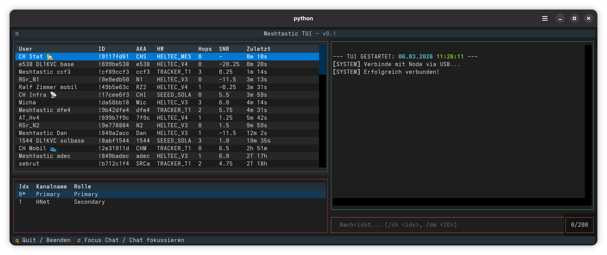

# Meshtastic TUI

A terminal-based user interface (TUI) for interacting with [Meshtastic](https://meshtastic.org/) devices via USB. This lightweight dashboard lets you monitor nodes, view channels, and chat directly from your terminal.


This is an independent community project and has no official connection to the Meshtastic core team.



## Features

* **Live Node Monitoring:** View connected nodes, their hardware models, SNR, hops, and "last seen" status in real-time.
* **Channel Management:** See available channels and their roles (Primary/Secondary).
* **Interactive UI:**
  * Click on a node in the table to prepare a Direct Message (DM).
  * Click on a channel in the table (or use keyboard arrows + Enter) to switch your active sending channel.
* **Chat Log:** Keep track of incoming and outgoing messages. Messages are also saved to `meshtastic_chatlog.txt`.
* **Bilingual Support:** Available in German (default) and English.

**Important note**
As long as the node is connected to the app, messages will not appear in the history, i.e., they will **not be visible** in the smartphone app. This applies to both sent and received messages.

## Requirements

Ensure you have Python 3 installed. You will need the following libraries:

```bash
pip install textual meshtastic pypubsub
```

## Usage

Connect your Meshtastic device via USB and run the script. The application will automatically attempt to connect to the node.

### Start in German (Default):

```bash
python meshtui.py
```

### Start in English:

```bash
python meshtui.py --en
```

### Controls & Commands

```
* q - Quit the application.
* c - Focus the chat input field.
* Click Node - Pre-fills the chat input with /dm <Node-ID> to send a direct message.
* Click Channel - Switches your active sending channel to the selected one.
```

### Chat Commands:

```
* /ch <index> - Switch the active channel manually (e.g., /ch 1).
* /dm <Node-ID> <message> - Send a direct message to a specific node.
* /rename <index> <name> - Rename a channel on your local node.
```

## Troubleshooting: Is my Node recognized?

### If the application cannot connect to your device, check the following:
* Check the TUI Log: When you start the app, look at the chat log. If it says [ERROR] Connection failed: ..., the script cannot find the USB device. If it says [SYSTEM] Successfully connected!, you are good to go.
* Test with the Official CLI: Open your terminal and run meshtastic --info. If this official command cannot communicate with your node, the TUI won't be able to either.
* Data vs. Charge Cable: Ensure you are using a USB data cable, not just a charging cable. This is the #1 cause of connection issues.
* USB Drivers: Depending on your operating system and the node's microcontroller (e.g., ESP32, nRF52), you might need to install serial drivers (such as CP210x or CH340).
* Close other Apps: Ensure no other application (like the Meshtastic WebUI, another terminal, or the serial monitor) is currently blocking the USB port.

### Linux-Specific Connection Issues
If you are using Linux and encounter a "Permission denied" error when the TUI tries to connect, your user account likely lacks the necessary rights to read and write to the serial port.
* Group Membership (Recommended): On most Debian/Ubuntu-based distributions, serial ports belong to the dialout group. On Arch-based systems, it is usually the uucp group. You can fix the permission issue by adding your user to this group. Open your terminal and run:

```bash
sudo usermod -aG dialout $USER
```
**Important:** You must log out and log back in (or restart your computer) for this change to take effect.

* udev Rules: Alternatively, you can configure udev rules to grant non-root users access to Meshtastic USB devices automatically. You can find the official Meshtastic udev rules and instructions in the Meshtastic Flashing Documentation.

### Getting Help
* For issues with this TUI: If the script crashes or you find a bug in the interface, please open an Issue in this GitHub repository. Include the error message from the meshtastic_chatlog.txt and your operating system.
* For general Meshtastic issues: If your computer doesn't recognize the node at all or you have hardware questions, please consult the official Meshtastic Documentation or ask the community in the official Meshtastic Discord server.

## License

This project is licensed under the GNU General Public License v3.0.

Copyright (C) 2026 der-bender
